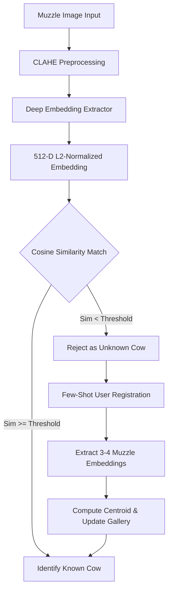

# 🐂 Cattle Muzzle Identification & Open-Set Recognition (OSR) System

[](https://www.python.org/)
[](https://pytorch.org/)
[](https://opencv.org/)
[](https://opensource.org/licenses/MIT)

An advanced, production-grade Computer Vision and Biometric Identification system designed for individualized cattle tracking. The system utilizes cattle muzzle print patterns (unique biometric identifiers, similar to human fingerprints) to recognize known cows and detect unregistered/unknown cows using **Open-Set Recognition (OSR)** and **Few-Shot Learning**.

---

## 📌 Project Overview

Traditional cattle identification methods (ear tags, branding, RFID) are often invasive, prone to damage, or easily lost. Muzzle prints offer a non-invasive, permanent, and unique biometric identifier.

This repository implements a complete biometric pipeline:
1. **Pre-processing**: CLAHE-enhanced contrast adjustment for skin/ridge patterns.
2. **Representation Learning**: Deep embedding extractor trained using **EfficientNet-B0 + ArcFace** loss (and ResNet-50 baselines).
3. **Open-Set Recognition**: Dynamic prototype gallery consisting of L2-normalized class centroids with optimized cosine similarity threshold tuning to reject unknown cows.
4. **Few-Shot Registration**: Active registration workflow where rejected unknown cows can be registered on-the-fly using only 3–4 muzzle images.
5. **Explainability**: Integrated **Grad-CAM** visualizations to highlight the discriminative features learned by the model.

---

## 🏗️ Architecture & Pipeline



---

## ✨ Core Features

### 🌟 1. Contrast Limited Adaptive Histogram Equalization (CLAHE)
Muzzle prints are highly dependent on micro-texture and ridge details. The system applies CLAHE specifically to the Y (luminance) channel in the YCrCb color space to enhance ridge lines and details while avoiding over-amplification of noise.

### 🌟 2. OSR Prototype Gallery
Instead of using soft-max logits (which suffer from the closed-world assumption), we build a **Prototype Gallery** of L2-normalized 512-dimensional mean embeddings (centroids) for all known cows.
- **Decision Rule**: A query sample $q$ is matched to the class $c^*$ that maximizes:
  $$\text{sim}(q, c) = \frac{\mathbf{v}_q \cdot \mathbf{v}_c}{\|\mathbf{v}_q\|_2 \|\mathbf{v}_c\|_2}$$
  If $\max_c \text{sim}(q, c) \geq \theta$ (Similarity Threshold), query is classified as $c^*$. Otherwise, it is flagged as **Unknown**.

### 🌟 3. Few-Shot Registration Workflow
When a new/unknown cow is detected and rejected, the system registers it instantly without retraining the network:
1. User provides **3–4 muzzle images**.
2. Embeddings are extracted and averaged to generate a new class centroid.
3. The new prototype is saved to `prototype_gallery.bin`, and database files are synchronized.
4. Subsequent queries immediately recognize the registered cow.

---

## 📊 Experimental Results

Our system trained with **EfficientNet-B0 + ArcFace** achieves outstanding biometric performance:

*   **Overall OSR Accuracy**: **`95.89%`**
*   **Macro Average F1-score**: **`97.87%`**
*   **Biometric Equal Error Rate (EER)**: **`~4.0%`**
*   **Unknown Cow Detection Precision**: **`96.19%`**

---

## 📂 Repository Structure

```
.
├── cattle_muzzle_analysis.ipynb      # Main dataset analysis, OSR training, and Few-Shot notebook
├── osr-system.ipynb                  # OSR pipeline system notebook
├── osr_prototype_gallery.py          # Unified command-line pipeline execution script
├── train_resnet50.py                 # ResNet-50 baseline model trainer
├── explore_dataset.py                # Dataset distribution analysis helper
├── known_cows_osr.csv                # List of registered known cattle IDs
├── unknown_cows_osr.csv              # List of candidate unknown cattle IDs
├── prototype_gallery.bin             # Serialization of class centroids
└── README.md                         # Project documentation
```

---

## 🚀 Setup & Execution

### 📋 Prerequisites
Ensure you have Python 3.8+ and the following dependencies installed:
```bash
pip install torch torchvision timm opencv-python scikit-learn pandas numpy matplotlib seaborn pillow
```

### 🏃 Running the Notebooks
You can run the full training, validation, evaluation, and explainability loop locally or on Kaggle:
```bash
jupyter notebook cattle_muzzle_analysis.ipynb
```

### 🏃 Running the Command Line Pipeline
To execute the baseline training and gallery creation script:
```bash
python osr_prototype_gallery.py
```

---

## 🔍 Few-Shot Registration Logic

Here is the code block appended to the analysis notebooks implementing the interactive registration loop:

```python
# Extract embeddings of the user-provided images
reg_embeddings = [extract_single_embedding(img_path, model, device, transform) for img_path in user_images]
new_centroid = np.mean(reg_embeddings, axis=0)
new_centroid_l2 = new_centroid / np.linalg.norm(new_centroid, ord=2)

# Save to prototype gallery
current_gallery[new_cow_id] = new_centroid_l2
with open("prototype_gallery.bin", "wb") as f:
    pickle.dump(current_gallery, f)
```

---

## 🛡️ License
Distributed under the MIT License. See `LICENSE` for more information.

## 🤝 Acknowledgments
* Dataset based on individualized cattle muzzle database collections.
* Backbone models powered by `timm` (PyTorch Image Models).
